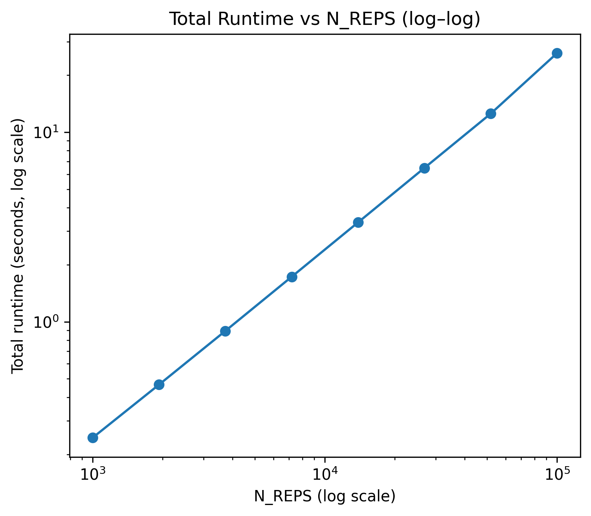

# Baseline Performance
*Unit 3*  
*Name: Judy Wu*

This file documents the runtime performance of Unit 2 project before improvement and optimization.

---

# 1. Simulation Configuration

The baseline (Unit 2) simulation uses the following parameters:

- **Repetitions per condition:** `N_REPS = 10000`
- **Methods evaluated:** `Bonferroni`, `Hochberg`, `Benjamin-Hochberg`
- **Hypothesis counts:**  
 $M \in \{4, 8, 16, 32, 64,128,256,512,1024,2048, 4096\} $
- **Proportion of true nulls:**  
  $ \pi_0 \in \{0.75, 0.5, 0.25, 0.0\}$
- **Effect size constant:** `L = 10`
- **Total simulation blocks:**   $ 11 \text{ (M)} \times 4 \text{ (π₀)} = 44$
- **Total replications:**  
  \[
  44 \times 10000 = 440{,}000
  \]

Each replication performs:

1. Data generation (`generate_pvalues`)
2. Application of 3 multiple-testing methods
3. Computation of FDR and Power metrics

---

# 2. Total Runtime of the Baseline Simulation

Using the original `run_simulation()` implementation:

### Global Totals
- Total simulation runtime: 93.894 seconds
- Average block time:       2.134 seconds
- Average per replication:  0.000213 seconds

### Component Totals
| Component            | Method Time (s) | Metrics Time (s) | Total Time (s) |
|----------------------|-----------------|------------------|-------------|
| **DGP**              | –               | –                | 30.847    |
| **Bonferroni**       | 0.559           | 4.252            | 4.811       |
| **Hochberg**         | 33.006          | 4.132            | **37.138**  |
| **Benjamini–Hochberg** | 15.871          | 4.067            | 19.938      |

# 3. Computational Complexity Analysis

## (a): Number of Hypotheses $m$

To empirically assess the computational complexity of each multiple-testing procedure, 
I measured the **average method time per replication** across a wide range of hypothesis counts:

$$m = \{4, 8, 16, 32, 64, 128, 256, 512, 1024, 2048, 4096\}.$$

The log–log plot below shows the relationship between computation time and the problem size m for 
Bonferroni, Hochberg, and Benjamini–Hochberg (BH):

The empirical complexity plot shows that for small $m$, all three methods have nearly identical runtimes. As 
m increases, Hochberg and BH begin to rise much faster than Bonferroni, consistent with their $O(m\log m)$ sorting step. Bonferroni grows much more slowly, matching its linear $O(m)$ trend. These trends confirm the theoretical complexity of the three procedures.

## (b): Number of Repetition $N$

We also assess the computational complexity according to the number of repetition. Since a for lopp was used, the theoretical complexity is $O(n)$. 

To empirically show the $O(n)$ complexity, we use $N\in \{10^3,\dots,10^5\}$, specifically eight values that are equally spaced on the $log_{10}$ scale. We record the total run time of the algorithm and obtain the following plot:

# 4. Numerical Instability
Throughout all 440,000 replications, no numerical warnings, errors, or instability-related issues were observed. 
Specifically, there was no floating-point overflow during Z-score generation or `norm.cdf` computation; no exceptions were raised during sorting in Hochberg or BH.
Moreover, the simulation contains no iterative optimization steps, so there were no convergence failures.
