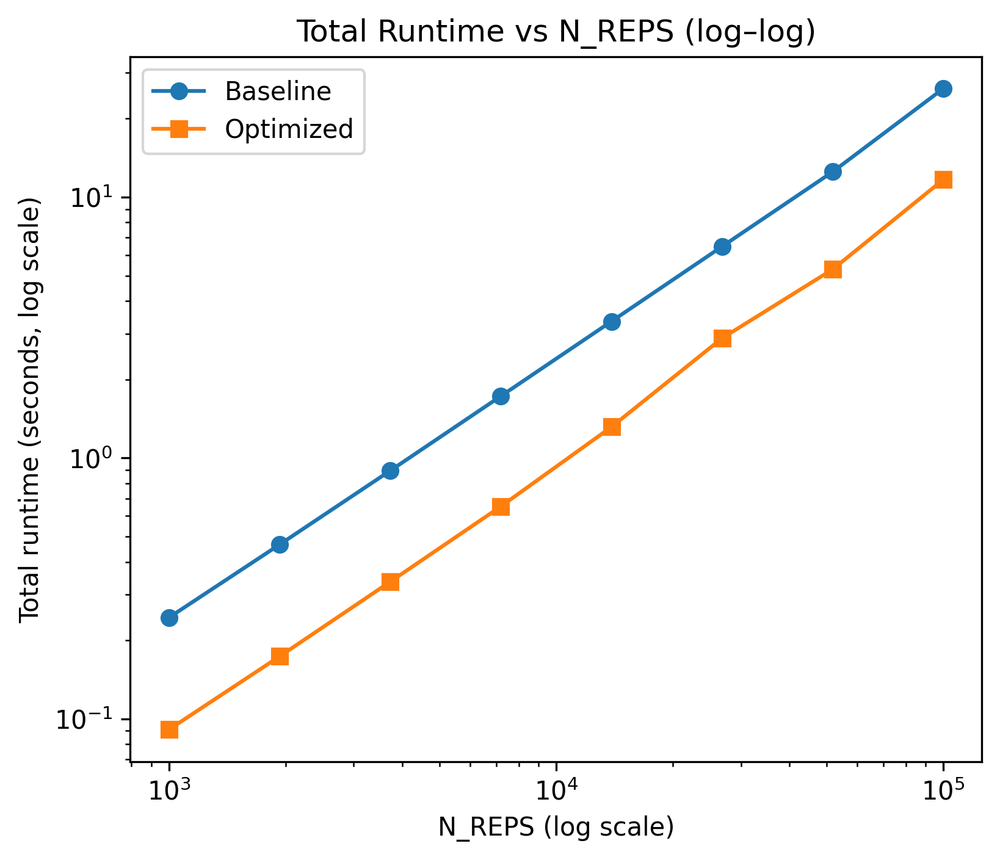

# Unit 3: Optimization Report
*Name: Judy Wu*

To optimize the algorithm implemented in Project 2, I applied array programming and parallelization to improve the performance, especially when having large number of hypotheses.

## Optimization
### 1. Algorithm Improvments
- **Issue revealed**:
  - Moreover, the empirical study review that the sorting step in BH and Hochberg procedure is of $O(m \log m)$ complexity, which makes algorithm computationally expensive when handling large $m$.
- **Solution implemented**:
  - To avoid performing the sorting step separately and make the algorithm more efficient, we do one sorting step and use the sorted p-values to perform BH and Hochberg procedure.
- **Code comparison**: 
  - Before (Code snippet from `methods.py`):
    ```{python, eval =FALSE}
        def hochberg(pvals, alpha = 0.05):
            m = len(pvals)
            sorted_idx = np.argsort(pvals)[::-1]  # descending
            sorted_p = pvals[sorted_idx]
            ...
            return reject
  
        def benjamini_hochberg(pvals, alpha= 0.05):
            m = len(pvals)
            order = np.argsort(pvals)
            sorted_p = pvals[order]
            ...
            return reject
    ```
  - After (Code snippet from `methods.py`):
    ```{python, eval=FALSE}
      def compute_rejections(p,alpha,idx):
        order = np.argsort(p, axis=1)
        p_sorted = np.take_along_axis(p, order, axis=1)
    
        # BH
        bh_threshold = alpha * idx/p.shape[1]
        bh = p_sorted <= bh_threshold
        ...
    
        #Hochberg
        hoch_threshold = alpha / (p.shape[1] - idx + 1)
        hoch = p_sorted <= hoch_threshold
        ...
    
        bonf_threshold = alpha / (p.shape[1])
        rej_bonf = p<=bonf_threshold
        return rej_bonf, rej_h, rej_bh
    ```
- Performance impact: 
  - This can improve the speed of the algorithm for a few seconds.


### 2. Array Programming
- **Issue revealed**: 
  - From profiling, we see that the algorithm is of $O(N)$ complexity, where $N$ is the number of repetition when computing the empirical power. To reduce the runtime and improve the computational efficiency when having large $N$, one should avoid using for loop.
- **Solution implemented**: 
  - Instead of generating one list of $m$ p-values each iteration and use for loop to repeat the process for N times, now I directly generate a $N\times M$ matrix, and apply the adjusted method function to the matrix.
- **Code comparison**: 
    - Before (in `simulation.py`): 
      ```{python, eval=FALSE}
      for pi0 in PI0_VALUES:
          for m in M_VALUES:
            ...
            for _ in tqdm(range(N_REPS), desc=desc):
                ...
       ```
    - After (Code snippet from `simulation.py`. `dgps.py`, `methods.py` and `metrics.py` are modified accordingly to handle matrix):
        ```{python, eval=FALSE}
        def _run_single_block(M, pi0, N_reps, alpha, L, seed, idx_cache):
            ...
            pvals, truth = generate_pvalues_matrix(M, N_reps, pi0, L, seed)
  
            rej_bonf, rej_h, rej_bh = compute_rejections(pvals, alpha, idx)
            fdp_bonf, pow_bonf = compute_fdp_power(rej_bonf, truth)
            fdp_h, pow_h = compute_fdp_power(rej_h, truth)
            fdp_bh, pow_bh = compute_fdp_power(rej_bh, truth)
            ...
       ```
- Performance impact: 
  - When only apply array computation, we can improve the total runtime with $N= 10000$ from about 90 seconds to around 35 seconds.




### 3. Parallelization
- **Issue revealed**: 
  -  The current implementation relies on a simple for-loop to iterate over all combinations of number of hypothese $m$ and the proportion of true null $\pi_0$, which results in serial execution and becomes inefficient for large configurations.
- **Solution implemented**: 
  - Parallelize the simulation across all combinations so that each block runs on a separate CPU core, which is much more efficient when having a large number of combinations.
- **Code comparison**: 
    - Before (in `simulation.py`): 
      ```{python, eval=FALSE}
      for pi0 in PI0_VALUES:
          for m in M_VALUES:
            ...
            for _ in tqdm(range(N_REPS), desc=desc):
                ...
       ```
    - After (Code snippet from `simulation.py`. `dgps.py`, `methods.py` and `metrics.py` are modified accordingly to handle matrix):
        ```{python, eval=FALSE}
        def _run_single_block(M, pi0, N_reps, alpha, L, seed, idx_cache):
            ...
        def run_simulation_optimized_parallel(M_list, pi0_list, N_reps, alpha, L, seed0=0, n_jobs=-1):
            idx_cache = {M: np.arange(1, M + 1) for M in M_list}
            tasks = []
            seed = seed0
            for pi0 in pi0_list:
                for M in M_list:
                    tasks.append((M, pi0, seed))
                    seed += 1
        
            results = Parallel(n_jobs=n_jobs)(
                delayed(_run_single_block)(M, pi0, N_reps, alpha, L, seed, idx_cache)
                for (M, pi0, seed) in tasks
            )
            ...
       ```
- Performance impact: 
  - When applying array computation + parallelization, we can improve the total runtime with $N= 10000$ from about 90 seconds to about 20 seconds.

## Profiling Evidence

The profiler output **before optimization**:
- Total simulation runtime: 93.894 seconds
- Average block time:       2.134 seconds
- Average per replication:  0.000213 seconds

The profiler output **after optimization**:
- Total runtime:       17.182 seconds
- Average block time:  2.272 seconds
- Note that here the average runtime per replication is not available since we applied array computation.


## Lessons learned
- The most impactful optimization was array computation, which greatly reduce the run time since we are using a relatively large number of repetition.
- Parallelization also helped since we can distribute the combinations across multiple cores.
- When this two methods combined, the run time was reduced about 75%, which represent a noticeable improvement.
- We did not observe much difference for the first method. However, the difference may be more obvious when having a much larger $m$. 